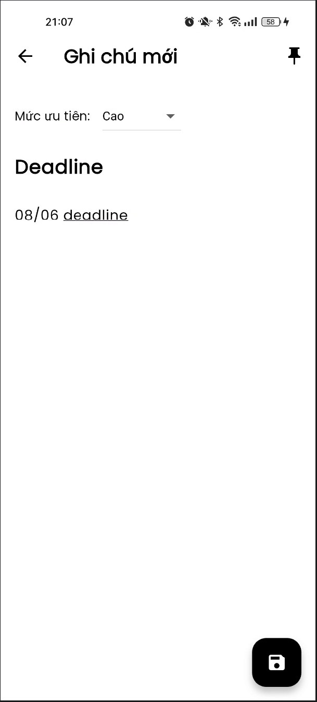
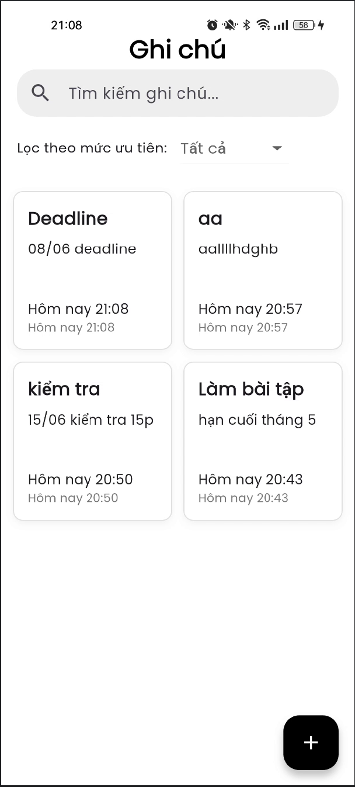
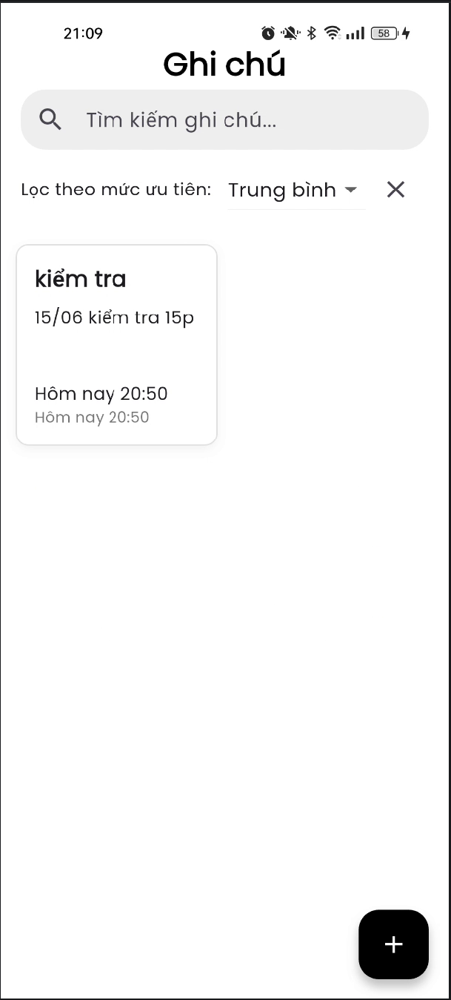
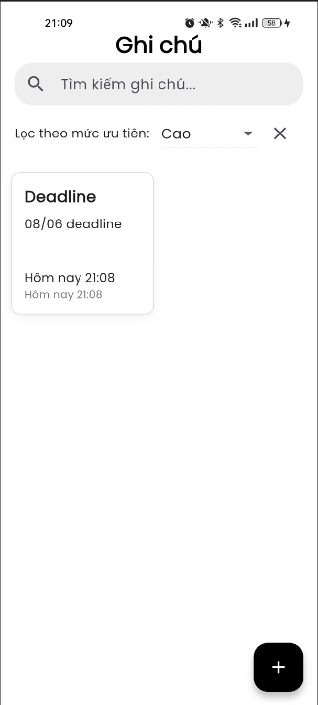
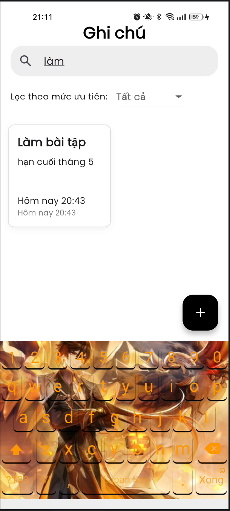

# 📝 Note App

## 📱 Mô tả dự án

Ứng dụng Note App (Quản lý ghi chú) được xây dựng bằng Flutter, cho phép người dùng tạo, lưu trữ và quản lý các ghi chú một cách hiệu quả.

Ứng dụng hỗ trợ nhiều tính năng như phân loại mức độ ưu tiên, ghim ghi chú quan trọng, tìm kiếm và lọc ghi chú, giúp người dùng dễ dàng ghi nhớ và sử dụng.

## 🚀 Các tính năng chính
- Thêm ghi chú mới
- Lưu ghi chú vào bộ nhớ cục bộ (SQLite)
- Ghim ghi chú quan trọng
- Tìm kiếm ghi chú theo tiêu đề hoặc nội dung
- Chọn mức độ ưu tiên:
    + Thấp
    + Trung bình
    + Cao
- Lọc ghi chú theo mức độ ưu tiên
- Hiển thị thời gian tạo / cập nhật ghi chú
- Xoá ghi chú

---

## 🖼️ Giao diện ứng dụng

<div align="center">
  <table>
    <tr>
      <td></td>
      <td></td>
      <td></td>
    </tr>
    <tr>
      <td></td>
      <td></td>
      <td></td>
    </tr>
  </table>
</div>

---

## 🛠️ Công nghệ sử dụng
- Flutter
- Provider (State Management)
- SQLite (sqflite)
- Path Provider

## 📂 Cấu trúc dự án

```bash
lib/
├── database/
│   └── db_helper.dart
│
├── models/
│   └── note.dart
│
├── providers/
│   └── note_provider.dart
│
├── screens/
│   ├── home_page.dart
│   └── note_editor_screen.dart
│
├── widgets/
│   └── note_card.dart
│
└── main.dart
```

---

## 🚀 Hướng dẫn chạy dự án

Clone project

```bash
git clone https://github.com/Noname2k4/flutter_note_app_VuHoangHiep
cd note_app
```

Cài đặt dependencies và chạy ứng dụng

```bash
flutter pub get
flutter run
```

---

## ⚠️ Hạn chế

- Chưa hỗ trợ đồng bộ dữ liệu (sync cloud)
- Chưa có tính năng nhắc nhở
- Giao diện còn đơn giản

## 🔮 Hướng phát triển

- Đồng bộ dữ liệu lên Firebase / Cloud
- Thêm nhắc nhở ghi chú
- Phân loại ghi chú theo tag / danh mục